# Personal Fitness Tracker (CalisTrain)


[](https://lawrence302.github.io/personal-calisthenics-tracker/)

_Level up your calisthenics journey with points, ranks, and progress tracking!_

**CalisTrain** is a Progressive Web App (PWA) and single-page application designed for calisthenics enthusiasts and bodyweight athletes. It allows users to log workouts, track progress, earn points, and receive AI-driven fitness guidance — all without the need for a gym.

The app gamifies calisthenics training by awarding points, displaying physical ranks, and providing visual insights into training frequency, consistency, and performance.

> _Where there is a floor, there is a gym. Your only limit is you._

---

### Why I Built CalisTrain

I created CalisTrain for calisthenics enthusiasts like myself who want a clear, structured way to track progress over time. The app is designed to help users log workouts, monitor improvements, and follow a progressive training structure tailored to bodyweight exercises — making it easier to stay consistent, motivated, and see real results.

## Screenshots / UI

<div style="display: flex; flex-wrap: wrap; gap: 10px; justify-content: center; align-items: flex-start;">

  <!-- Desktop Screenshots -->
  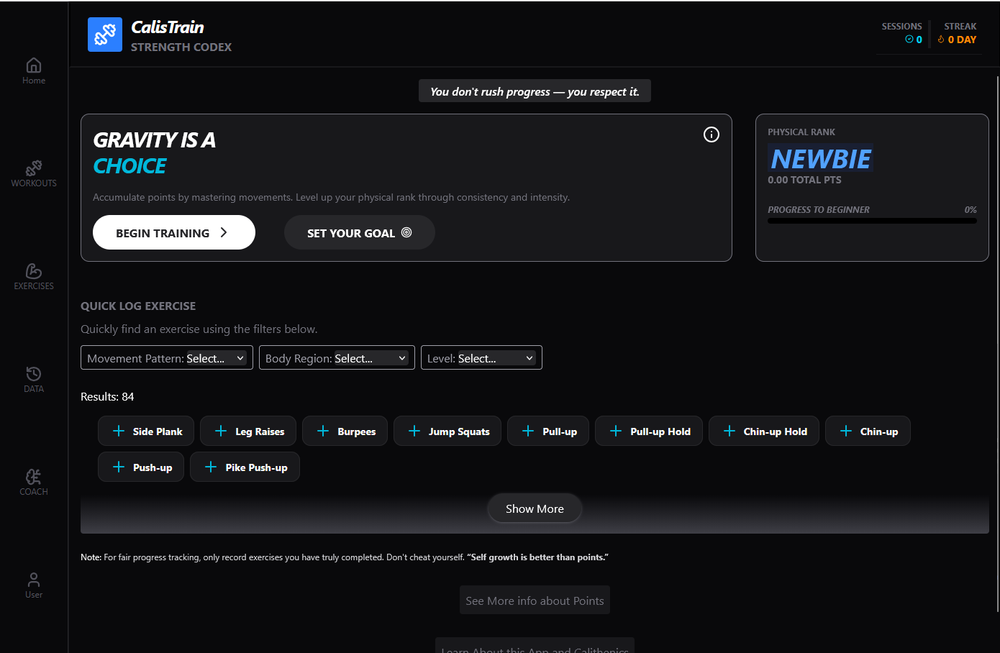
  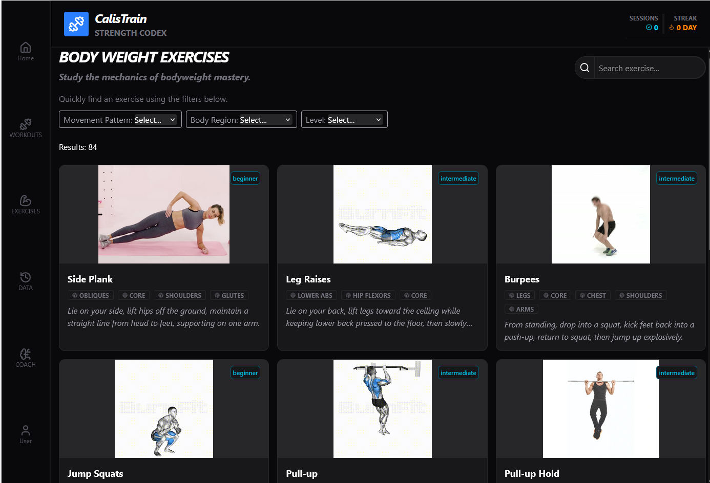
  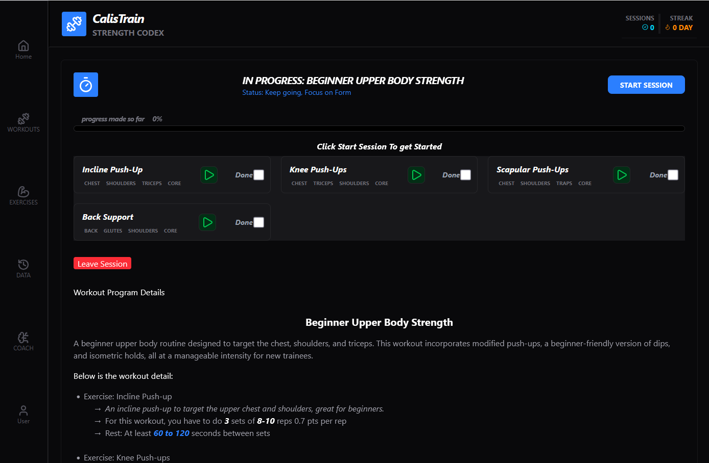
  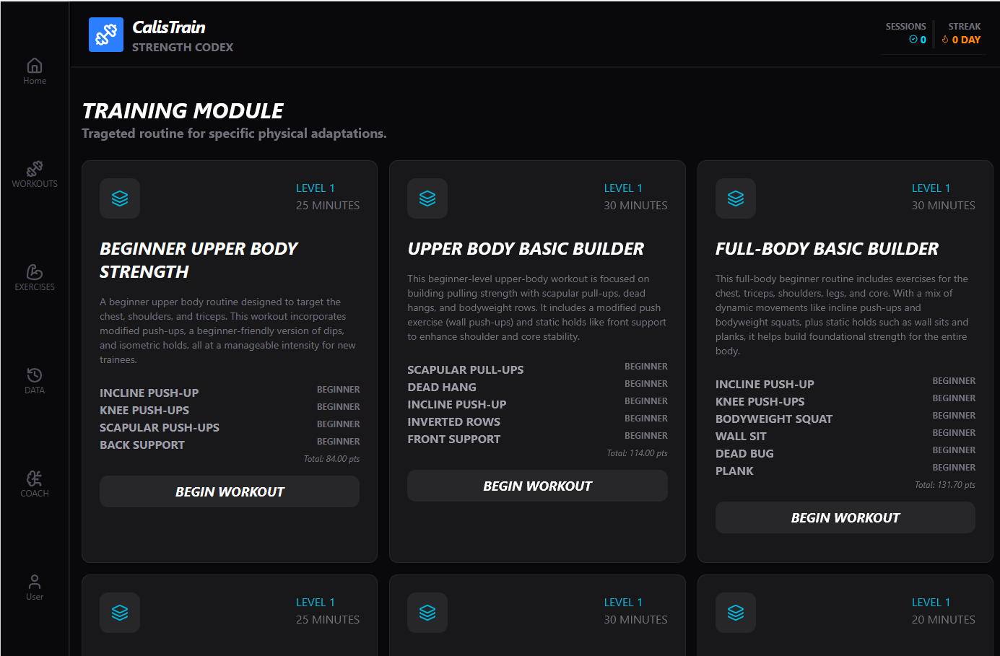

  <!-- Mobile Screenshots -->
  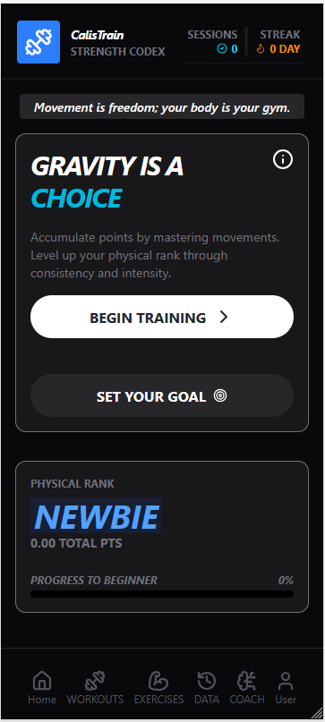
  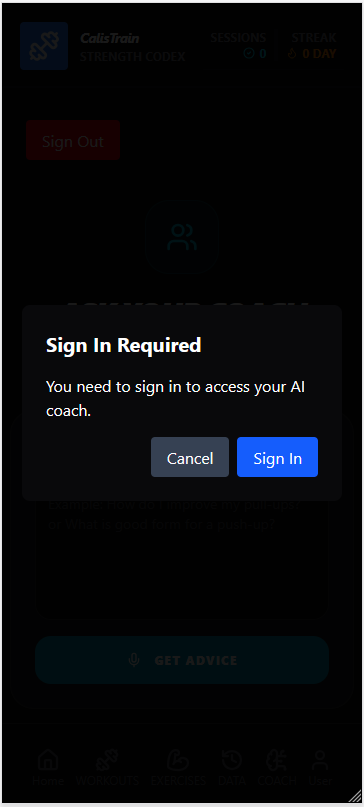
  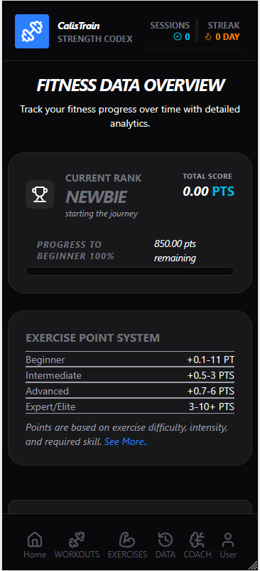
  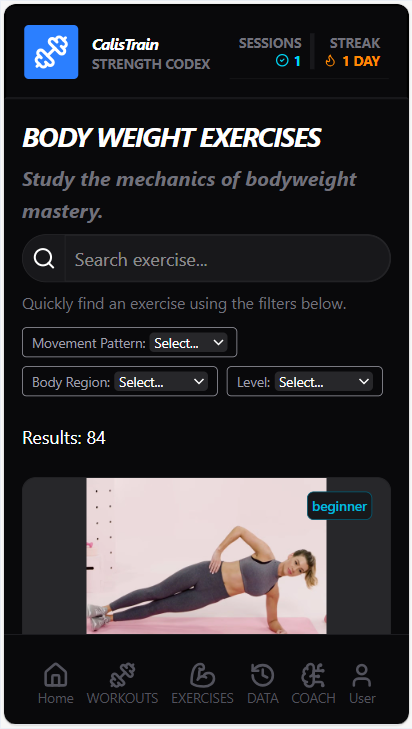
  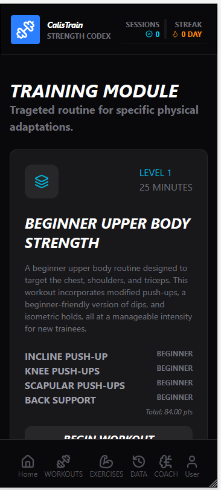
  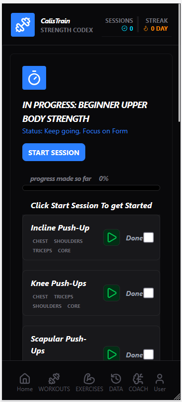
    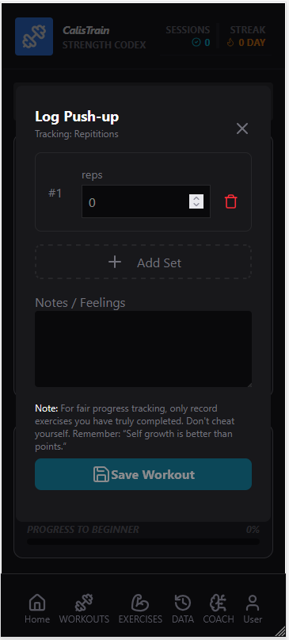
  <!-- AI / Other Screenshots -->
  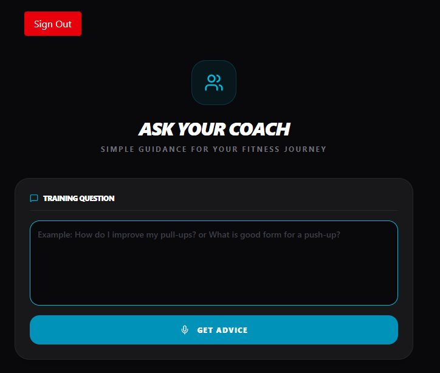

</div>

## Table of Contents

- [Features](#features)
- [Tech Stack](#tech-stack)
- [Project Structure](#project-structure)
- [Getting Started](#getting-started)
- [Usage](#usage)
- [Database](#database)
- [Charts / Analytics](#charts--analytics)
- [Screenshots / UI](#screenshots--ui)
- [License](#license)

## Features

- **Single-page App (SPA):** Components dynamically render without full page reloads.

- **Progressive Web App (PWA):** Installable on devices, works offline, and provides app-like experience.

- **Quick Log Exercise:** Log exercises immediately with customizable sets and reps/duration.

- **Points & Physical Rank System:** Track cumulative points and see progress toward ranks.

- **Session Tracking:** Monitor training sessions over time with charts and analytics.

- **Exercise Frequency Tracking:** Visualize favorite exercises and repetition frequency.

- **Interactive Charts:** Area and Bar charts showing trends and stats.

- **Responsive Design:** Works on mobile and desktop screens.
- **Gemini AI Integration:** Ask personal fitness questions and get AI guidance within the app.

- **Authentication via Clerk:** Secure login required for the Gemini AI section.

- **Workout Timer / Countdown:** Pre-defined workout routines with built-in timers for sets and exercises.

- **User-Friendly Interface:** Intuitive design for effortless navigation during workouts.

- **Motivational Tier System:** Earn ranks and badges as you progress, encouraging consistent training.

---

## Tech Stack

### Frontend

- React (Functional Components + Hooks)
- TailwindCSS for styling
- Recharts for interactive charts
- Lucide Icons for UI icons

### State Management

- Zustand (for points, streaks, and app-wide state)

### Backend / AI Integration

- Gemini AI (personal fitness Q&A integration)
- Clerk Auth (secure login for AI section)

### Database / Storage

- IndexedDB via custom `initDB` wrapper

### Utilities

- Luxon (date and time handling)
- UUID (unique identifiers)

### Development Tools

- TypeScript
- Vite (build tool and dev server)

---

## Usage

Follow these steps to get started with **CalisTrain** and make the most out of your calisthenics journey:

### 1. Open the App

- Install CalisTrain as a **Progressive Web App (PWA)** on your mobile or desktop.
- Access it through your browser or the home screen icon.

### 2. Sign Up / Log In

- Create an account or log in to start tracking your workouts.
- Logging in is required to use features like **Gemini AI Coach** and **workout session tracking**.

### 3. Set Up Your Profile

- Click the **user icon** on the bottom menu bar.
- In your profile component, click **Edit Profile**.
- Fill in your details: name, age, height, and fitness goals.
- Click **Save** to complete your profile setup.

### 4. Log Exercises Quickly

- On the home page, locate the **Quick Log Exercise** section.
- Filter exercises by:
  - **Movement Pattern:** Push, Pull, Legs, Core, Isometric, Explosive, Full-Body
  - **Body Region:** Core, Upper-Body, Lower-Body, Full-Body
  - **Level:** Beginner, Intermediate, Advanced
- To log an exercise:
  1. Click the **plus button** next to the exercise name.
  2. Enter sets, reps, or duration.
  3. Add additional sets if needed.
  4. Click **Save Workout** when done.

### 5. Find a Training Program

- Go to **Training** from the homepage, sidebar (desktop), or bottom bar (mobile).
- Browse workouts filtered by level and body region.
- Click **Begin Workout** to start a session.
- During a session:
  - Click **Start Session**.
  - Click the **green play button** next to each exercise to log it.
  - Click **Done** to mark the exercise as complete.
- Additional workout information is displayed below the session.

### 6. Browse the Complete Exercise List

- Click **Exercises** in the sidebar (desktop) or bottom bar (mobile).
- Filter exercises the same way as in **Quick Log Exercise**.
- Click an exercise name to view detailed information in a modal.

### 7. Track Your Progress

- Click **Data** in the sidebar (desktop) or bottom bar (mobile).
- View charts for recent activities and favorite exercises.
- To see points and ranks: scroll down and click **See more info about points**.
- View your **tier table**, exercises, and points allocation.

### 8. Use Gemini AI Coach

- Click **Coach** in the sidebar (desktop) or bottom bar (mobile).
- Sign in to access the AI.
- Enter your query in the input box and click **Get Advice**.

### 9. View App Information

- Scroll to the bottom of the **Home** page and click **Learn About This App & Calisthenics**.
- Click **See More Info About Points** to view tier and points allocation information.

### 10. View Exercise Logs

- Go to your **User Account** and click **View Workout Logs**.
- See all past exercises and session history.

### 11. Key Features While Using the App

- **Log Exercises Quickly:** Enter sets, reps, or duration, and save.
- **Track Training Sessions:** Start a session, complete exercises, and points are logged automatically.
- **View Stats & Progress:** Dashboard shows physical rank, total points, progress to next rank, and charts for session history and favorite exercises.
- **Points System:** Each exercise has assigned points; completing exercises adds to total points and rank.

---

## Charts / Analytics

- Exercise Frequency Chart: Displays the number of times each exercise is performed.

- Session Chart: Shows training sessions over time, using area charts to visualize trends.

- Points Chart: Shows points obtained on individual days.

## Getting Started

### 1. Clone the repository

```bash
git clone https://github.com/Lawrence302/personal-calisthenics-tracker.git
cd personal-calisthenics-tracker
```

### 2. Install dependencies

```bash
npm install
```

### 3. Run the app in development

```bash
npm run dev
```
